<div align="center">

# 🎯 Job Apply Assistant

**An AI copilot for the entire job-search loop — find roles, judge fit, tailor materials, auto-apply, and track every response.**

Runs as a Chrome extension + local FastAPI backend + optional native desktop app.
Cloud (Azure OpenAI) or fully-local (Ollama) AI. Your data never leaves your machine.

`Chrome MV3` · `FastAPI` · `SQLite` · `Tauri 2` · `Azure OpenAI / Ollama`

</div>

---

## Table of contents

1. [What it does](#1-what-it-does)
2. [System architecture](#2-system-architecture)
3. [Quick start](#3-quick-start)
4. [The four components](#4-the-four-components)
5. [Feature deep-dive](#5-feature-deep-dive)
6. [LLM routing (cloud / local / hybrid)](#6-llm-routing)
7. [Data model](#7-data-model)
8. [API reference](#8-api-reference)
9. [Building the desktop app](#9-building-the-desktop-app)
10. [Configuration](#10-configuration)
11. [Safety, limits & honest caveats](#11-safety-limits--honest-caveats)
12. [Project layout](#12-project-layout)

---

## 1. What it does

The job hunt is a loop. This tool automates the tedious parts of every stage while keeping you in control of the decisions that matter.

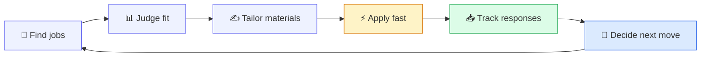

| Stage | What the tool does |
|-------|--------------------|
| **Find** | Search LinkedIn (keyword/URL) or paste company career-portal links; harvest all Easy-Apply jobs into a queue |
| **Judge fit** | One-click fit analysis: score /100, strengths, gaps, recommendations, language requirements, best-CV selection |
| **Tailor** | AI cover letters, screening-question answers grounded in your CV, recruiter DMs |
| **Apply** | Guided or fully-automated Easy Apply on LinkedIn; multi-step form filling on SuccessFactors portals (Siemens, T-Systems, SAP…) |
| **Track** | Gmail sync auto-classifies recruiter replies and updates application status; full pipeline + analytics |
| **Decide** | Context-aware chat that knows the job you're viewing, your CV, and your tracked applications |

---

## 2. System architecture

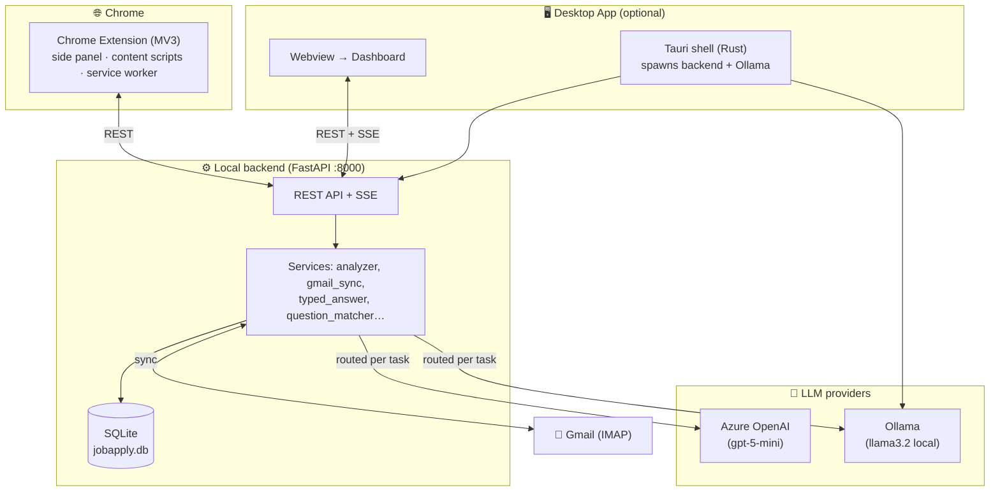

**Design principles**

- **Local-first.** Backend, database, and (optionally) the LLM all run on your machine. Cloud is opt-in.
- **One backend, many clients.** The extension, the browser dashboard, and the desktop webview all talk to the same `localhost:8000` API and the same SQLite DB — so history is synchronized everywhere.
- **The extension does the browser work.** Form-filling and apply automation happen in content scripts (which can see the page); the backend never touches a browser.

---

## 3. Quick start

### Prerequisites
- Python 3.11+ · Node 18+ (only for the desktop build) · Chrome
- *(optional)* [Ollama](https://ollama.com) for local AI · Azure OpenAI key for cloud AI

### Run in dev mode (3 steps)

```bash
# 1 — Backend
cd backend
python -m venv .venv && source .venv/bin/activate
pip install -r requirements.txt
python -m uvicorn app.main:app --reload --port 8000
#   Dashboard is now at  http://localhost:8000/dashboard/

# 2 — Load the extension
#   chrome://extensions → enable Developer mode → "Load unpacked" → select  extension/

# 3 — Set up
#   Open the dashboard → upload a CV → fill Profile → (optional) add your Azure key in Settings
```

### First-run checklist

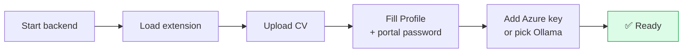

---

## 4. The four components

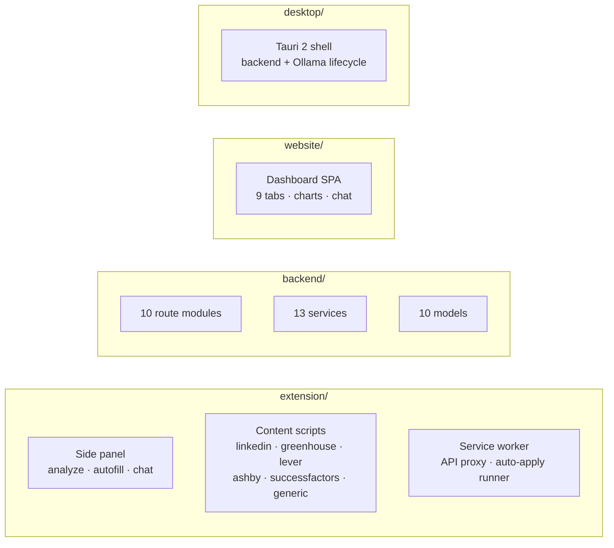

| Component | Tech | Role |
|-----------|------|------|
| `extension/` | Chrome MV3, vanilla JS | On-page UI, form automation, the apply engine |
| `backend/` | FastAPI, SQLAlchemy, SQLite | API, AI orchestration, persistence |
| `website/` | Vanilla JS SPA | Dashboard (served by FastAPI at `/dashboard`) |
| `desktop/` | Tauri 2 (Rust) | Packages everything into a native app |

---

## 5. Feature deep-dive

### 5.1 Fit analysis

Open any job page → side panel → **Analyze this page**. The content script extracts the JD, the backend (`services/analyzer.py` + `cv_match.py` + `language.py`) returns:

- **Fit score /100** with label, **strengths**, **gaps**, **recommendations**, **verdict**
- **Best-CV auto-selection** — scores each CV in your library against the JD and uses the strongest
- **Language requirements** — flags non-English requirements *only* when they appear in a real requirement context (not page-footer chrome)

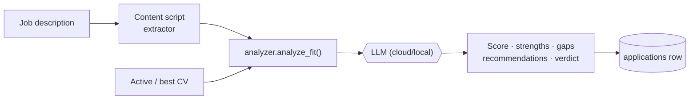

### 5.2 Autofill & guided Easy Apply

- **Universal autofill** (`content/autofill.js`) — 6 label-discovery strategies, React/Vue-safe native setters, iframe descent, English + German field maps. Works on Greenhouse, Lever, Ashby, Workday, and unknown sites.
- **Guided LinkedIn Easy Apply** (`content/linkedin_easyapply.js`) — walks every step of the modal, fills text/number/select/radio/**typeahead** fields, ticks required consents, and **stops at Submit for your review**. Type-aware answers come from your question bank first, then the LLM.

### 5.3 Auto-apply (unattended)

Dashboard → **Auto-apply** tab. Three ways to feed the queue:

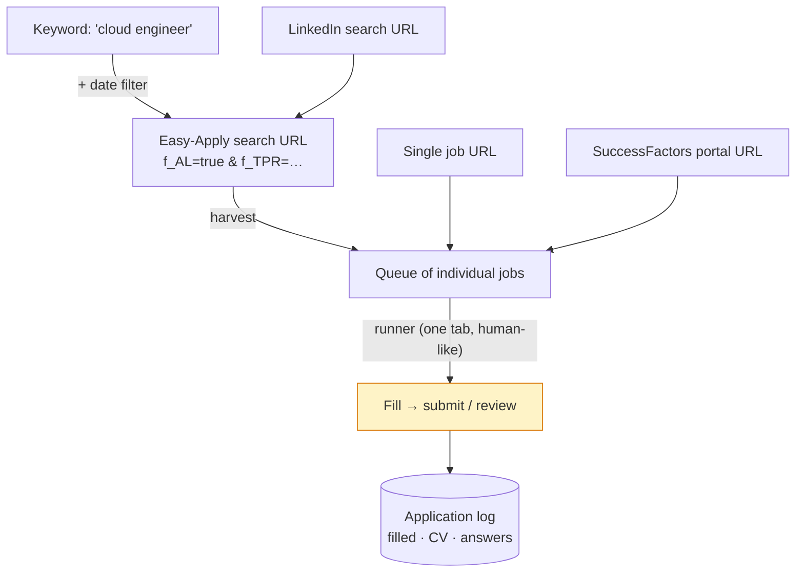

- **Modes:** *One tab (human-like)* walks the results list in place; *New tab per job* opens each separately.
- **Date filter:** Past 24h / week / month / any (keyword searches).
- **Daily cap** + randomized 45–120s gaps between submits.
- **Skips** anything needing human answers or external-apply jobs; **auto-pauses on captcha**.
- **Heartbeat:** the extension pings the backend every ~25s so the dashboard shows a live *Extension connected* status.
- **Per-job log:** title, company, fields filled, **which CV was used**, and the full table of screening answers it submitted — split into **LinkedIn Easy Apply** / **Company portals** tabs.

### 5.4 Company career portals (SuccessFactors)

`content/successfactors.js` covers SAP SuccessFactors — the ATS behind **Siemens, Deutsche Telekom/T-Systems, SAP** and most large EU employers. It harvests search results, walks the multi-step application, creates a portal account using your email + a **reusable portal password** (stored locally, masked in the UI), ticks mandatory data-privacy consents, and either submits or stops for review based on your **Portals: Fill & review / Auto-submit** setting.

### 5.5 Gmail sync & response tracking

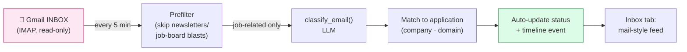

- Connect with a Gmail **app password** (2FA required). Read-only — never modifies your mailbox.
- Incremental UID sync, dedupe by Message-ID, ≤200 emails/pass.
- **Inbox tab:** summary cards (Interviews / Offers / Rejections / This week), search, company dropdown, and a **LinkedIn vs Companies** split. Job-board alert spam never reaches the feed.

### 5.6 Question bank

280+ seeded screening questions across technical/logistics/salary/motivation/behavioral/diversity. Each stores typed answer variants (number, text, select, radio). The Easy Apply engine looks here **first** before calling the LLM, so repeat questions are instant and consistent. Collapsible rows in **My answers** show answered (✓) vs unanswered (!) at a glance.

### 5.7 Context-aware chat

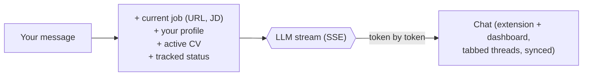

- **Streaming** replies (SSE) — no blank "Thinking…".
- **Threads/tabs** — each conversation is saved; start a new tab, the old one keeps its history. Auto-titled from the job or first message.
- **Synced** across extension side panel and dashboard (same backend DB).

### 5.8 Analytics dashboard

The **Overview** and **Analytics** tabs render from `applications/stats` and `analytics/overview`:

- Pipeline funnel (Analyzed → Interviewing → Offers, with conversion %)
- Last-30-days activity bar chart
- Color-coded fit-score distribution
- "Where you're applying" by source
- CV performance, source effectiveness, response-time stats, top recurring gaps, language demand

---

## 6. LLM routing

Three provider modes, set in **Settings**:

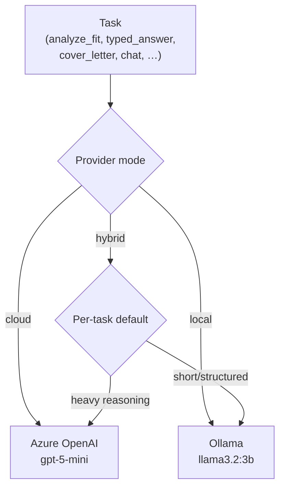

**Hybrid defaults** (override per-task in the UI):

| Task | Default | Why |
|------|---------|-----|
| `analyze_fit` | cloud | Heaviest reasoning, biggest quality gap |
| `cover_letter` | cloud | Writing quality matters |
| `chat` | cloud | Conversational quality |
| `draft_answer` | cloud | Nuanced first-person prose |
| `typed_answer` | local | Short Easy-Apply field |
| `structure_cv` | local | Short structured extraction |
| `email_classify` | local | Short classification |

Every cloud call logs token usage + estimated cost to the `llm_usage` table (`services/llm_pricing.py`). Startup verifies the deployment; `/health` reports status.

---

## 7. Data model

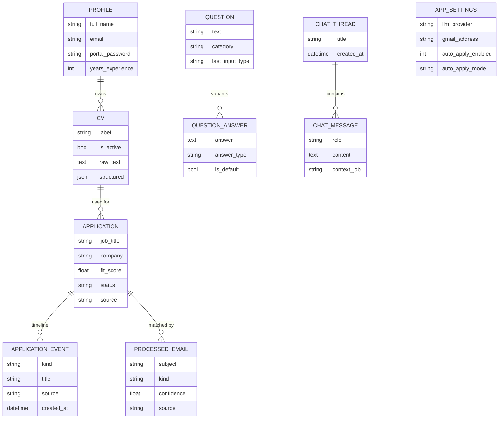

Schema migrations are additive via `database.py:ensure_schema()` — new columns are `ALTER TABLE … ADD COLUMN` on startup, safe to run repeatedly.

---

## 8. API reference

The backend exposes ~60 endpoints across 10 routers. Highlights:

<details>
<summary><b>Applications & auto-apply</b> (<code>/applications</code>)</summary>

| Method | Path | Purpose |
|--------|------|---------|
| GET | `/applications/` | List applications |
| GET | `/applications/stats` | Overview stats (totals, fit buckets, sources) |
| POST | `/applications/queue` | Queue jobs/searches/keywords (with `time_range`) |
| GET | `/applications/auto-apply/status` | Runner status, queue counts, worker heartbeat |
| POST | `/applications/auto-apply/toggle` | Start/stop, set cap, mode, portal-submit |
| POST | `/applications/auto-apply/heartbeat` | Extension liveness ping |
| POST | `/applications/{id}/auto-result` | Record one job's apply outcome |
| POST | `/applications/{id}/expanded` | Record harvested jobs from a search task |
| POST | `/applications/auto-apply/session-batch` | Record a same-tab session run |
| GET | `/applications/auto-apply/log` | Per-job log (filter by `platform`) |

</details>

<details>
<summary><b>Analyze, CVs, Profile, Questions</b></summary>

| Method | Path | Purpose |
|--------|------|---------|
| POST | `/analyze/` | Fit analysis |
| POST | `/analyze/cover-letter` | Generate cover letter |
| POST | `/analyze/answer` | Draft a screening answer |
| POST | `/analyze/linkedin-message` | Draft a recruiter DM |
| GET/POST/DELETE | `/cvs/…` | CV library + set-active |
| GET/PUT | `/profile/` | Profile (`?reveal=true` for portal password) |
| POST | `/questions/answer-for-form` | Type-aware answer for a form field |
| POST | `/questions/match` | Fuzzy-match a question to the bank |

</details>

<details>
<summary><b>Chat, Email, Settings, Analytics</b></summary>

| Method | Path | Purpose |
|--------|------|---------|
| GET/POST | `/chat/threads` | Thread CRUD |
| POST | `/chat/stream` | SSE streaming reply |
| POST | `/emails/gmail/connect` | Connect Gmail (app password) |
| POST | `/emails/gmail/sync` | Run a sync pass |
| GET | `/emails/gmail/processed` | Job-response feed (filter/search) |
| GET/PUT | `/settings/` | LLM provider, credentials |
| GET | `/analytics/overview` | Pipeline, trends, CV/source performance |
| GET | `/health` | Backend + model status |

</details>

---

## 9. Building the desktop app

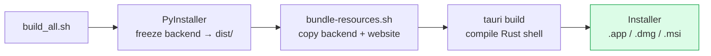

```bash
# Full build (re-freezes backend, bundles website, builds installer)
rm -rf backend/dist            # force a fresh backend freeze
bash build_all.sh

# App-only (skip the fragile DMG step during dev)
cd desktop && npx tauri build --bundles app
# → desktop/src-tauri/target/release/bundle/macos/Job Apply Assistant.app
```

**On launch** the Tauri shell (`desktop/src-tauri/src/lib.rs`):
1. Resolves a per-user data dir and points the backend at it
2. Spawns the bundled backend (or reuses one already on :8000)
3. Downloads + starts Ollama if needed, with a progress bar
4. Waits for `/health`, then loads the dashboard (or onboarding on first run)
5. Kills backend + Ollama on quit

The loading screen shows a **real progress bar** and a **live step log** (✓ with timings) driven by Rust boot events.

---

## 10. Configuration

`.env` is searched in (first match wins): `./`, `backend/`, the per-OS app-data dir, `~/.jobapply.env`.

```bash
AZURE_OPENAI_ENDPOINT=https://your-resource.openai.azure.com/
AZURE_OPENAI_API_KEY=...          # or set it in the Settings UI (stored in DB)
AZURE_OPENAI_DEPLOYMENT=gpt-5-mini
AZURE_OPENAI_API_VERSION=2024-02-15-preview
DATABASE_URL=sqlite:///...        # defaults to app-data dir
```

| Setting | Where | Notes |
|---------|-------|-------|
| Azure credentials | `.env` **or** Settings UI | UI value (DB) overrides `.env` |
| LLM provider mode | Settings | cloud / local / hybrid + per-task |
| Local model + base URL | Settings | default `llama3.2:3b` @ `localhost:11434/v1` |
| Gmail | Inbox tab | App password, read-only IMAP |
| Portal password | Profile | Reused for career-portal accounts |
| Data location | `~/Library/Application Support/JobApplyAssistant/` (mac) | DB + uploads, survives rebuilds |

---

## 11. Safety, limits & honest caveats

> [!WARNING]
> **Unattended applying breaks LinkedIn's Terms of Service.** LinkedIn detects automated apply behavior (request cadence, fast form completion, tab patterns) and responds with captchas, then temporary or permanent restrictions. The randomized pacing and same-tab mode **reduce but do not eliminate** detection. There is no "undetectable" automation.

**Recommended use:** harvest jobs automatically, but **submit via guided mode** (you click the final button) — that reads as a real person and doesn't trip detection. Keep the daily cap low. If you start seeing captchas, **stop and let the account rest for several days**.

Other honest limitations:
- **SuccessFactors** is themed per employer — the adapter is best-effort; unusual screening questions land in *needs review* rather than being answered (the safe outcome).
- **Portal password** is stored in plaintext in local SQLite (same as the Azure key) — fine for a single-user local app, but it's a real credential on disk.
- **No tests yet** on the heuristic-heavy content scripts; they're verified manually and can drift when sites redesign.
- **No multi-user/auth** — single profile, trusts `localhost`.

---

## 12. Project layout

```
job-apply-extension/
├── extension/                  # Chrome MV3 extension
│   ├── manifest.json
│   ├── background/service_worker.js     # API proxy + auto-apply runner + heartbeat
│   ├── sidepanel/                       # analyze · autofill · chat UI
│   └── content/
│       ├── autofill.js                  # universal form filler
│       ├── linkedin_easyapply.js        # guided + sequential apply, typeahead
│       ├── successfactors.js            # SAP portal adapter
│       ├── greenhouse · lever · ashby · generic · question_suggest · apply_watcher
├── backend/                    # FastAPI
│   └── app/
│       ├── main.py · config.py · database.py
│       ├── routes/   (10)      # analyze, applications, chat, cvs, emails, …
│       ├── services/ (13)      # analyzer, gmail_sync, typed_answer, …
│       └── models/   (10)      # application, cv, profile, question, chat, …
├── website/                    # Dashboard SPA (served at /dashboard)
│   ├── index.html · app.js · style.css
├── desktop/                    # Tauri 2 native shell
│   └── src-tauri/src/          # lib.rs, backend.rs, ollama.rs, commands.rs
├── build_all.sh
└── README.md
```

---

<div align="center">

Built with FastAPI, Chrome MV3, Tauri, and your choice of Azure OpenAI or Ollama.

**Local-first · your data stays on your machine.**

</div>
